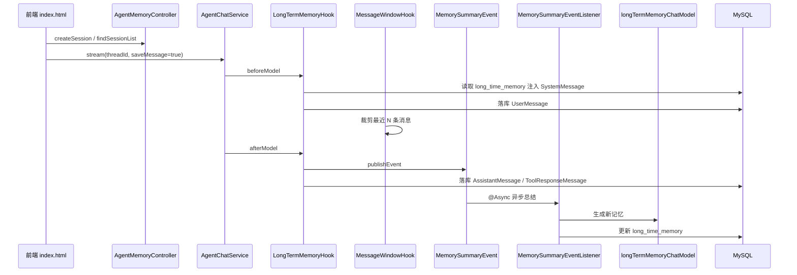

# Zephyr Agent Scaffold

基于 Spring Boot、Spring AI Alibaba 和 MyBatis-Plus 的 AI Agent 应用脚手架。项目内置 Web 对话页面、SSE 流式输出、Agent YAML 配置、账号登录注册、微信扫码登录、Sa-Token 登录态、Knife4j/OpenAPI 文档等基础能力，适合作为 Agent 应用的二次开发起点。

## 功能特性

- Agent 对话：支持同步对话和基于 SSE 的流式对话。
- Agent 配置：通过 YAML 配置 Agent、模型、工具、MCP、Multi-Agent 编排等能力。
- 用户认证：支持账号注册、账号登录、微信 openid 登录或注册。
- 登录态管理：基于 Sa-Token 管理登录会话。
- 数据持久化：基于 MyBatis-Plus 和 MySQL 持久化用户数据。
- **会话记忆**：支持会话与消息持久化、滑动窗口上下文裁剪、会话级长期记忆总结与注入。
- 前端页面：提供对话页、账号登录/注册页、微信扫码登录页。
- 接口文档：集成 Knife4j 和 SpringDoc OpenAPI。
- 统一响应：使用 `BaseResponse` 和 `ResultUtil` 封装接口返回。

## 技术栈

- Java 17
- Spring Boot 3.5.14
- Spring AI 1.1.7
- Spring AI Alibaba 1.1.2.3
- MyBatis-Plus 3.5.16
- MySQL 9.6.0 Driver
- Sa-Token 1.45.0
- Knife4j 4.4.0
- Hutool
- Lombok
- Redis / Redisson，可按配置关闭
- 前端：原生 HTML、CSS、JavaScript；登录页使用 Tailwind CSS 和 daisyUI CDN

## 模块结构

```text
zephyr-agent-scaffold
├── README.md
├── pom.xml
├── dev-ops
│   └── sql
│       └── init.sql
├── zephyr-agent-scaffold-app
│   ├── src/main/java/com/object/ai/Application.java
│   └── src/main/resources
│       ├── application.properties
│       ├── application-local.properties
│       ├── agent
│       │   ├── only-one-agent.yml
│       │   └── demo-agent.yml
│       └── static
│           ├── index.html
│           ├── login.html
│           └── wechat-login.html
└── zephyr-agent-scaffold-core
    └── src/main/java/com/object/ai
        ├── agent
        ├── auth
        ├── common
        └── memory          # 会话记忆：Hook、事件监听、CRUD API
```

- `zephyr-agent-scaffold-app`：应用启动类、运行配置、静态前端页面和 Agent YAML 配置。
- `zephyr-agent-scaffold-core`：核心业务模块，包含 Agent 对话、用户认证、微信扫码登录、通用异常和统一响应。
- `dev-ops/sql/init.sql`：数据库初始化脚本。

## 快速开始

### 环境要求

- JDK 17+
- Maven 3.8+
- MySQL 8+
- Redis，可选；默认配置可关闭 Redis
- 微信公众号配置，可选；仅微信扫码登录需要

### 初始化数据库

创建数据库：

```sql
CREATE DATABASE agent_scaffold DEFAULT CHARACTER SET utf8mb4 COLLATE utf8mb4_unicode_ci;
```

执行初始化脚本：

```text
dev-ops/sql/init.sql
```

当前脚本会创建以下表：

- `tb_user`：用户表，包含账号、密码、微信 openid、角色、状态、昵称、逻辑删除等字段。
- `tb_session`：Agent 会话表，`id` 同时作为 Agent `threadId`，存储会话级长期记忆。
- `tb_message`：消息记录表，按 `session_id` + `message_index` 唯一索引存储对话历史。

### 修改配置

主配置文件位于：

```text
zephyr-agent-scaffold-app/src/main/resources/application.properties
```

重点配置项：

```properties
server.servlet.context-path=/api

spring.datasource.username=root
spring.datasource.password=root
spring.datasource.url=jdbc:mysql://localhost:3306/agent_scaffold?useUnicode=true&characterEncoding=utf8&autoReconnect=true&zeroDateTimeBehavior=convertToNull&serverTimezone=UTC&useSSL=true

mybatis-plus.mapper-locations=classpath:/mapper/*.xml

springdoc.swagger-ui.path=/swagger-ui.html
springdoc.api-docs.path=/v3/api-docs
springdoc.group-configs[0].group=default
springdoc.group-configs[0].paths-to-match=/**
springdoc.group-configs[0].packages-to-scan=com.object.ai

wechat.mp.app-id=your-test-app-id
wechat.mp.secret=your-test-app-secret
wechat.mp.token=your-custom-token

redis.config.enable=false

# 长期记忆总结（默认关闭，避免无 API Key 时启动报错）
long-term-memory.enabled=false
long-term-memory.type=openai
long-term-memory.base-url=
long-term-memory.api-key=
long-term-memory.model=gpt-4o-mini
```

`application-local.properties` 可用于本地私有配置覆盖，例如数据库密码、微信 appId、微信 secret、Redis 密码等。不要把真实密钥提交到公共仓库。

### 启动应用

在项目根目录执行：

```bash
mvn -pl zephyr-agent-scaffold-app -am spring-boot:run
```

如果本机没有安装 Maven，先安装 Maven 或为项目补充 Maven Wrapper。

## 页面入口

默认上下文路径是 `/api`。

- 对话页面：`http://localhost:8080/api/index.html`
- 登录/注册页面：`http://localhost:8080/api/login.html`
- 微信扫码登录页面：`http://localhost:8080/api/wechat-login.html`
- Knife4j 文档：`http://localhost:8080/api/doc.html`
- Swagger UI：`http://localhost:8080/api/swagger-ui.html`
- OpenAPI JSON：`http://localhost:8080/api/v3/api-docs`

## 核心接口

### 用户认证

- `POST /api/auth/register`：账号注册。
- `POST /api/auth/login`：账号登录。
- `POST /api/auth/wechat/login-or-register`：根据微信 openid 登录或注册。

账号注册请求示例：

```json
{
  "registerType": "account",
  "registerAccount": "demo",
  "registerCertificate": "123456",
  "username": "演示用户"
}
```

账号登录请求示例：

```json
{
  "loginType": "account",
  "loginAccount": "demo",
  "loginCertificate": "123456"
}
```

微信 openid 登录或注册请求示例：

```json
{
  "wxOpenid": "wechat-openid"
}
```

### 微信扫码登录

- `POST /api/auth/wechat/qrcode`：创建微信登录二维码。
- `GET /api/auth/wechat/qrcode/{ticketId}`：轮询二维码登录状态。
- `GET /api/wechat/callback`：微信公众号服务器 URL 验证。
- `POST /api/wechat/callback`：微信公众号事件和消息回调。

微信扫码登录流程：

1. 前端调用 `POST /api/auth/wechat/qrcode` 创建二维码。
2. 用户扫码后，公众号回复验证码提示。
3. 用户在公众号中回复验证码。
4. 前端轮询 `GET /api/auth/wechat/qrcode/{ticketId}`。
5. 状态变为 `CONFIRMED` 后，前端调用 `POST /api/auth/wechat/login-or-register` 完成应用登录。

### Agent 对话

`AgentController` 需要登录态，访问前应先完成登录。

- `POST /api/agent/chat`：同步对话，返回完整文本。
- `POST /api/agent/stream`：SSE 流式对话。
- `POST /api/agent/findAgentList`：查询当前配置的 Agent 列表。

流式对话请求示例：

```json
{
  "message": "你好",
  "threadId": "demo-thread",
  "agentId": "agent-001",
  "agentName": "日常聊天助手",
  "model": "deepseek-v4-flash",
  "apiKey": "sk-xxxx",
  "baseUrl": "https://example.com"
}
```

### 会话记忆

`AgentMemoryController` 需要登录态。详见 [记忆系统](#记忆系统) 章节。

- `POST /api/agent/memory/findSessionList`：查询当前用户会话列表。
- `POST /api/agent/memory/createSession`：创建会话。
- `POST /api/agent/memory/updateSession`：更新会话。
- `POST /api/agent/memory/deleteSession`：删除会话。
- `POST /api/agent/memory/findMessageList`：查询会话消息列表。

创建会话请求示例：

```json
{
  "id": "可选，自定义 threadId",
  "sessionName": "新对话",
  "agentId": "agent-001"
}
```

## Agent 配置

当前默认导入：

```properties
spring.config.import=classpath:agent/only-one-agent.yml
```

配置文件位置：

- `zephyr-agent-scaffold-app/src/main/resources/agent/only-one-agent.yml`：当前默认使用的单 Agent 配置。
- `zephyr-agent-scaffold-app/src/main/resources/agent/demo-agent.yml`：更完整的 Agent、MCP、Multi-Agent 配置示例。

`only-one-agent.yml` 的核心结构：

```yaml
spring:
  ai:
    agent:
      table-map:
        only-one-agent:
          app-name: my-ai-application
          app-type: openai
          agent:
            agent-id: agent-001
            agent-name: 日常聊天助手
          module:
            api:
              api-key: sk-xxxx
              base-url: https://example.com
            chat-model:
              model: deepseek-v4-flash
            agent-nodes:
              - key: daily-node
                name: 日常聊天助手
                system-prompt: 负责处理用户日常业务咨询和数据分析的Agent
            agent-runner:
              run-agent-key: daily-node
```

建议将真实 API Key 放在本地私有配置或环境变量中，不要提交到仓库。

## 前端页面说明

- `index.html`：ChatGPT 风格对话页，支持**后端会话历史**、本地设置、主题切换、SSE 流式输出。
- `login.html`：账号登录和注册页，支持登录成功后跳转对话页。
- `wechat-login.html`：微信扫码登录页，扫码确认后自动兑换应用登录态并跳转对话页。

前端页面目前是静态资源，无需前端构建流程。

## 开发说明

### `.properties` 中文编码

Spring Boot 默认按 ISO-8859-1 读取 `.properties`。如果配置中需要中文，建议：

- 使用 Unicode 转义。
- 或改用 YAML 配置。
- 或通过 `spring.config.import=classpath:xxx.properties[encoding=utf-8]` 为导入的配置指定编码。

### Knife4j 没有扫描到接口

确认配置中不要给 `.properties` 值加单引号：

```properties
springdoc.group-configs[0].group=default
springdoc.group-configs[0].paths-to-match=/**
springdoc.group-configs[0].packages-to-scan=com.object.ai
```

同时注意上下文路径是 `/api`，访问文档时需要带上 `/api`。

## 记忆系统

记忆系统将会话（Session）、消息（Message）与长期记忆（Long-term Memory）统一管理，支撑多轮对话的持久化、上下文裁剪和跨轮次信息保留。

### 设计目标

| 能力 | 说明 |
|------|------|
| 会话持久化 | 每个用户拥有独立会话列表，会话 `id` 即 Agent `threadId` |
| 消息落库 | 对话过程中由 Hook 自动写入 `tb_message`，支持 user / assistant / tool 角色 |
| 短期上下文 | `MessageWindowHook` 在模型调用前裁剪消息窗口，控制 Token 消耗 |
| 长期记忆 | 会话级文本摘要存于 `tb_session.long_time_memory`，下次对话注入 SystemMessage |
| 权限隔离 | 会话 CRUD 按登录用户隔离，管理员可跨用户访问 |

### 整体架构



### 数据模型

**`tb_session`（会话表）**

| 字段 | 说明 |
|------|------|
| `id` | 主键，同时作为 Agent `threadId` |
| `session_name` | 会话名称 |
| `user_id` | 所属用户 |
| `agent_id` | 关联 Agent |
| `long_time_memory` | 会话级长期记忆文本摘要 |
| `summary_count` | 记忆总结次数 |
| `last_message_at` | 最后一条消息时间 |
| `status` | `active` / `archived` |

**`tb_message`（消息表）**

| 字段 | 说明 |
|------|------|
| `session_id` | 所属会话 |
| `role` | `user` / `assistant` / `system` / `tool` |
| `message_content` | 消息正文 |
| `attachment` | 附件 fileId 列表（JSON 数组） |
| `metadata` | 工具调用等扩展信息（JSON） |
| `message_index` | 会话内序号，与 `session_id` 组成唯一约束 |

消息序号通过 `MAX(message_index) + 1` 计算，而非列表下标，因此与 `MessageWindowHook` 的滑动窗口裁剪兼容。

### 代码结构

```text
zephyr-agent-scaffold-core/src/main/java/com/object/ai/memory/
├── config/
│   └── LongTermMemoryConfiguration.java    # 总结用 ChatModel + 异步线程池
├── constants/
│   └── MemoryMetadataKeys.java             # save_message、file_ids
├── controller/
│   └── AgentMemoryController.java          # 会话 / 消息 REST API
├── event/
│   └── MemorySummaryEvent.java
├── hooks/
│   ├── LongTermMemoryHook.java             # 记忆注入 + 消息落库 + 发布总结事件
│   └── MessageWindowHook.java              # 滑动窗口裁剪（默认保留 10 条）
├── listener/
│   └── MemorySummaryEventListener.java     # 异步 LLM 总结并写回 DB
├── tools/
│   ├── MemoryTools.java                    # 历史消息 / 长期记忆查询 Tool
│   └── MemoryToolSupport.java
├── mapper/
│   ├── SessionMapper.java
│   └── MessageMapper.java                  # upsertBySessionAndIndex
├── model/
│   ├── enums/          SessionStatusEnum, MessageRoleEnum
│   ├── po/             SessionPO, MessagePO
│   ├── vo/             SessionVO, MessageVO
│   ├── request/        查询 / 创建 / 更新 DTO
│   └── properties/     MemorySummarizationChatModelProperties
├── service/
│   └── AgentMemoryServiceImpl.java
└── support/
    └── SessionPermissionChecker.java       # 会话归属校验
```

### Hook 机制

Hook 基于 Spring AI Alibaba Graph 的 `MessagesModelHook`，在 Agent YAML 的 `hooks` 中注册 Bean 名称（驼峰形式）。

#### LongTermMemoryHook

在 `BEFORE_MODEL` 和 `AFTER_MODEL` 两个阶段工作，仅当 `RunnableConfig` 元数据 `save_message=true` 时生效（由前端 `saveMessage` 字段控制）。

**beforeModel：**

1. 从 `tb_session` 读取 `long_time_memory`，若非空则追加到 `SystemMessage` 末尾。
2. 将最后一条 `UserMessage` 落库，附带 `file_ids` 元数据中的附件 ID。

**afterModel：**

1. 发布 `MemorySummaryEvent`（携带 `threadId` 与当前消息列表）。
2. 将最后一条 `AssistantMessage` 或 `ToolResponseMessage` 落库；工具调用信息写入 `metadata`。

#### MessageWindowHook

在 `BEFORE_MODEL` 阶段将消息列表裁剪为「首个 SystemMessage + 最近 10 条消息」，使用 `UpdatePolicy.REPLACE` 替换上下文。可与 `LongTermMemoryHook` 组合使用：窗口控制短期上下文，长期记忆弥补被裁剪的历史信息。

#### Agent YAML 注册示例

```yaml
agent-nodes:
  - key: daily-node
    name: 日常聊天助手
    system-prompt: 负责处理用户日常业务咨询和数据分析的Agent
    hooks:
      - messageWindowHook      # 可选：滑动窗口
      - longTermMemoryHook     # 消息落库 + 长期记忆
```

当前默认配置 `only-one-agent.yml` 已注册 `longTermMemoryHook`。

### 长期记忆总结

长期记忆采用**事件驱动 + 异步处理**，不阻塞 Agent 主流程。

1. `LongTermMemoryHook.afterModel` 在**轮次结束**时发布 `MemorySummaryEvent`（最后一条为无 `toolCalls` 的 `AssistantMessage`）；工具循环中间步骤只落库、不总结。
2. `MemorySummaryEventListener` 通过 `@Async("memoryTaskExecutor")` 在独立线程池（`memory-summary-*`）中执行。
3. 读取已有记忆，将对话文本（跳过 SystemMessage，格式化 user / assistant / tool）拼装为 Prompt。
4. 调用独立配置的 `longTermMemoryChatModel` 生成新摘要（≤500 字）。
5. 写回 `tb_session.long_time_memory`，`summary_count` 自增。

监听器与 ChatModel、线程池均在 `long-term-memory.enabled=true` 时注册；关闭时事件仍可能发布，但无监听器消费，不影响主流程。

**配置项**（`application.properties`）：

```properties
long-term-memory.enabled=false
long-term-memory.type=openai          # 或 dashscope
long-term-memory.base-url=
long-term-memory.api-key=
long-term-memory.model=gpt-4o-mini
```

启用步骤：

1. 设置 `long-term-memory.enabled=true` 并填写有效 `api-key`（及 `base-url`，OpenAI 兼容接口需要）。
2. 确认 Agent YAML 已注册 `longTermMemoryHook`。
3. 前端或 API 请求中传入 `saveMessage: true`。

### 对话请求中的元数据传递

`AgentChatServiceImpl` 根据请求参数构建 `RunnableConfig`：

```java
// saveMessage=true 时写入元数据，Hook 据此决定是否落库
builder.addMetadata(MemoryMetadataKeys.SAVE_MESSAGE, true);
builder.addMetadata(MemoryMetadataKeys.FILE_IDS, fileIds);  // 可选
```

流式对话请求示例：

```json
{
  "message": "你好",
  "threadId": "会话ID",
  "agentId": "agent-001",
  "saveMessage": true
}
```

`threadId` 须与 `tb_session.id` 一致；前端在创建会话后将 `session.id` 作为 `threadId` 传入。

### 记忆 REST API

`AgentMemoryController` 路径前缀 `agent/memory`，均需登录（`@SaCheckLogin`）。

| 接口 | 说明 |
|------|------|
| `POST agent/memory/findSessionList` | 查询当前用户会话列表（不分页，按 `last_message_at` 降序） |
| `POST agent/memory/createSession` | 创建会话，可指定 `id`（即 threadId） |
| `POST agent/memory/updateSession` | 更新会话名称、Agent、状态 |
| `POST agent/memory/deleteSession` | 逻辑删除会话及其消息 |
| `POST agent/memory/findMessageList` | 按 `sessionId` 查询消息列表 |

会话列表接口不返回 `longTimeMemory` 字段（列表 VO 中置空），长期记忆仅通过 Hook 在对话时注入模型上下文。

### 前端集成

`index.html` 已对接后端记忆 API：

- 登录后通过 `findSessionList` 加载侧边栏会话。
- 新建 / 切换会话时调用 `createSession`，切换时懒加载 `findMessageList`。
- 清空当前聊天 = `deleteSession` + `createSession`（新 threadId）。
- 流式请求固定 `saveMessage: true`（`SAVE_MESSAGE` 常量）。
- 单轮对话结束后本地追加助手消息，不重复拉取消息列表。
- 点赞 / 点踩反馈仍存于浏览器 `localStorage`（`chat_message_feedback`），未入库。

### 记忆查询 Tool（MemoryTools）

当 Redis checkpoint 过期或 `MessageWindowHook` 裁剪上下文后，Agent 可通过 Tool 按需从 MySQL 拉取冷数据。

| Tool | 说明 |
|------|------|
| `getConversationHistory` | 分页查询 `tb_message` 历史，默认 20 条、最大 50 条 |
| `getLongTermMemory` | 读取 `tb_session.long_time_memory` 摘要 |

**安全设计**：`sessionId` 从 `ToolContext` 内的 `RunnableConfig.threadId()` 获取，不由模型传参；`user_id` 元数据用于校验会话归属。

**注册方式**（`only-one-agent.yml`）：

```yaml
tool-mcp-list:
  - local:
      bean-name: memoryTools
```

**前提**：对话请求 `saveMessage: true`，且 `longTermMemoryHook` 已将消息落库。

### 已知限制与后续方向

- **连发消息未延迟合并**：用户快速连续发送多条消息时，每轮结束仍会各触发一次总结；若需合并可叠加 `debounce-seconds` 延迟调度。
- **长期记忆无 REST 读写**：目前仅 Hook 注入、Listener 写回，不提供独立管理 API。
- **消息窗口固定为 10 条**：`MessageWindowHook.MAX_MESSAGES` 尚未配置化。
- **反馈未持久化**：前端点赞 / 点踩仅存本地。

### Redis 配置

如果本地没有 Redis，可以关闭：

```properties
redis.config.enable=false
```

如果启用 Redis，请配置：

```properties
redis.config.enable=true
redis.config.host=localhost
redis.config.port=6379
redis.config.password=
```

### Maven Wrapper

当前仓库未包含 `mvnw`。如果希望其他开发者无需预装 Maven，可以后续补充 Maven Wrapper。

## 常见问题

### 页面接口为什么是 `/api/xxx`？

因为配置了：

```properties
server.servlet.context-path=/api
```

所以静态页面和后端接口都在 `/api` 前缀下。

### 对话接口返回 401 或未登录怎么办？

`AgentController` 使用了 `@SaCheckLogin`，需要先通过账号登录、账号注册或微信扫码登录获取登录态。

### 微信扫码登录需要哪些配置？

需要配置微信公众号的 `app-id`、`secret`、`token`，并将公众号服务器回调地址指向：

```text
http://你的域名/api/wechat/callback
```

本地开发如需调试微信回调，通常需要内网穿透工具。

## 后续可完善

- 增加更完整的用户管理能力，例如封禁、角色授权、资料修改。
- 增加登录页和对话页的登录态校验与退出登录。